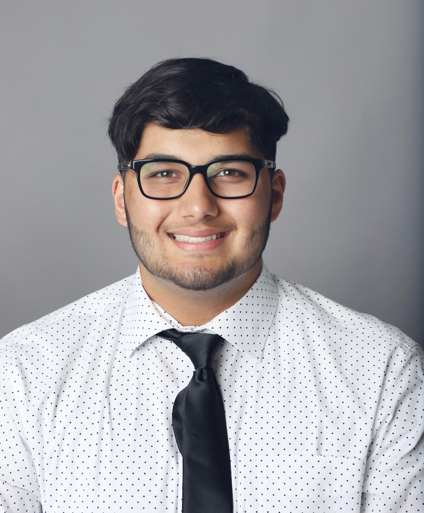

  
  <h3>Zakari</h3>
  
Zakari is a second-year Epidemiology MPH student (’26) interested in causal inference, causal discovery, and algorithmic fairness.

  
  <h3>Kimia</h3>
  
Kimia is a second year Epidemiology MPH student (‘26) with an interest in biostatistics and data science, as well as humanitarian work.

  
  <h3>Sukhman</h3>
  
Sukhman is a second-year Epidemiology MPH student (’26) focused on biostatistics, computational methods, and cancer epidemiology.

  
  <h3>Law</h3>
  
Lawrence is a second-year Epidemiology MPH student (‘26) with a focus on biostatistics, policy research and spatial analysis.

  Go back [home](home.html)

