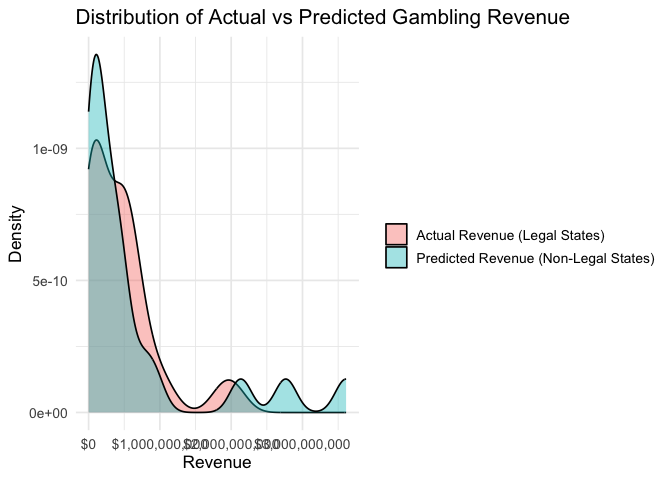

Prediction Model Sukhman
================
2025-11-30

``` r
library(tidyverse)
```

    ## ── Attaching core tidyverse packages ──────────────────────── tidyverse 2.0.0 ──
    ## ✔ dplyr     1.1.4     ✔ readr     2.1.5
    ## ✔ forcats   1.0.1     ✔ stringr   1.5.2
    ## ✔ ggplot2   4.0.0     ✔ tibble    3.3.0
    ## ✔ lubridate 1.9.4     ✔ tidyr     1.3.1
    ## ✔ purrr     1.1.0     
    ## ── Conflicts ────────────────────────────────────────── tidyverse_conflicts() ──
    ## ✖ dplyr::filter() masks stats::filter()
    ## ✖ dplyr::lag()    masks stats::lag()
    ## ℹ Use the conflicted package (<http://conflicted.r-lib.org/>) to force all conflicts to become errors

``` r
library(rvest)
```

    ## 
    ## Attaching package: 'rvest'
    ## 
    ## The following object is masked from 'package:readr':
    ## 
    ##     guess_encoding

``` r
library(httr)
library(jsonlite)
```

    ## 
    ## Attaching package: 'jsonlite'
    ## 
    ## The following object is masked from 'package:purrr':
    ## 
    ##     flatten

``` r
library(glmnet)
```

    ## Loading required package: Matrix
    ## 
    ## Attaching package: 'Matrix'
    ## 
    ## The following objects are masked from 'package:tidyr':
    ## 
    ##     expand, pack, unpack
    ## 
    ## Loaded glmnet 4.1-10

``` r
library(dplyr)
library(webshot2)
```

## Data scraping gambling revenue and growth

``` r
url = "https://rg.org/statistics/us"
gambling_html = read_html(url)
```

``` r
gambling_html |>
  html_table()
```

    ## [[1]]
    ## # A tibble: 40 × 5
    ##    State       Handle          Revenue        Hold   Taxes       
    ##    <chr>       <chr>           <chr>          <chr>  <chr>       
    ##  1 Arizona     $7,959,647,194  $427,397,087   5.53%  $42,739,709 
    ##  2 Arkansas    -               $107,275,202   -      $13,945,776 
    ##  3 Colorado    $6,187,564,044  $475,176,731   7.87%  $31,934,112 
    ##  4 Connecticut $2,188,745,557  $187,349,516   8.67%  $25,760,559 
    ##  5 Delaware    $216,240,459    $14,585,100    6.99%  $8,474,813  
    ##  6 Florida     -               -              -      -           
    ##  7 Illinois    $14,016,684,933 $1,866,642,282 13.52% $280,390,692
    ##  8 Indiana     $5,212,332,663  $484,278,308   9.48%  $46,245,605 
    ##  9 Iowa        $2,770,339,580  $218,482,781   8.07%  $14,747,588 
    ## 10 Kansas      $2,503,492,581  $145,263,244   5.96%  $13,873,150 
    ## # ℹ 30 more rows
    ## 
    ## [[2]]
    ## # A tibble: 12 × 5
    ##    Month          Handle          Revenue        Hold   Taxes       
    ##    <chr>          <chr>           <chr>          <chr>  <chr>       
    ##  1 January 2025   $15,721,477,197 $1,650,645,417 11.21% $354,670,341
    ##  2 February 2025  $12,382,871,791 $1,239,102,150 9.69%  $262,962,206
    ##  3 March 2025     $15,481,330,121 $996,986,477   6.75%  $220,983,072
    ##  4 April 2025     $12,792,017,473 $1,164,871,656 9.35%  $260,844,090
    ##  5 May 2025       $12,787,489,120 $1,430,346,654 11.14% $325,897,450
    ##  6 June 2025      $10,010,350,813 $1,559,587,432 12.69% $285,024,313
    ##  7 July 2025      $8,811,387,460  $963,982,575   10.81% $208,715,680
    ##  8 August 2025    $10,765,611,897 $1,164,308,572 11.98% $254,251,721
    ##  9 September 2025 $15,438,117,768 $1,228,482,775 8.65%  $264,083,960
    ## 10 October 2025   $13,859,996,349 $1,185,962,986 11.70% $284,880,585
    ## 11 November 2025  -               -              -      -           
    ## 12 Total          -               -              -      -           
    ## 
    ## [[3]]
    ## # A tibble: 38 × 1
    ##    X1                                
    ##    <chr>                             
    ##  1 Arizona Sports Betting Revenue    
    ##  2 Arkansas Sports Betting Revenue   
    ##  3 Colorado Sports Betting Revenue   
    ##  4 Connecticut Sports Betting Revenue
    ##  5 Delaware Sports Betting Revenue   
    ##  6 Florida Sports Betting Revenue    
    ##  7 Illinois Sports Betting Revenue   
    ##  8 Indiana Sports Betting Revenue    
    ##  9 Iowa Sports Betting Revenue       
    ## 10 Kansas Sports Betting Revenue     
    ## # ℹ 28 more rows
    ## 
    ## [[4]]
    ## # A tibble: 3 × 3
    ##   Challenge             `Key Stat (2025)`                 Impact on Sports Bet…¹
    ##   <chr>                 <chr>                             <chr>                 
    ## 1 Regulatory Compliance 39 U.S. states + Washington D.C.… Increases operational…
    ## 2 Gambling Addiction    2.5M U.S. adults have severe gam… Drives demand for str…
    ## 3 High Tax Rates        51% GGR tax in NY, RI, NH         Limits profitability,…
    ## # ℹ abbreviated name: ¹​`Impact on Sports Betting Industry`
    ## 
    ## [[5]]
    ## # A tibble: 6 × 3
    ##   Trend                 `2025 Highlight`                         `What It Means`
    ##   <chr>                 <chr>                                    <chr>          
    ## 1 Mobile Dominance      Over 80% of online gambling via mobile   Convenience, a…
    ## 2 Bettor Engagement     20% of U.S. adults bet on sports         Growing user b…
    ## 3 Popular Formats       Parlays = 27% of bets                    Multi-leg bets…
    ## 4 Media Integration     ESPN BET’s FanCenter syncs fantasy with… Seamless conve…
    ## 5 Major Event Impact    Super Bowl handle hit $1.39B             Live events re…
    ## 6 Demographic Expansion Bettor participation rose to 26%, drive… Market broaden…
    ## 
    ## [[6]]
    ## # A tibble: 3 × 3
    ##   Technology                   `Use in Sports Betting`    Impact on Bettors & …¹
    ##   <chr>                        <chr>                      <chr>                 
    ## 1 Artificial Intelligence (AI) Analyzes player performan… Enables more accurate…
    ## 2 Machine Learning & Big Data  Processes massive dataset… Shifts betting from i…
    ## 3 Blockchain & Web3            Creates transparent, dece… Improves trust, autom…
    ## # ℹ abbreviated name: ¹​`Impact on Bettors & Industry`
    ## 
    ## [[7]]
    ## # A tibble: 5 × 3
    ##   Measure             Description                                         Impact
    ##   <chr>               <chr>                                               <chr> 
    ## 1 AI Risk Detection   Uses machine learning to identify harmful betting … Enabl…
    ## 2 Loss Limits         Caps on daily, weekly, or monthly spending          Preve…
    ## 3 Self-Exclusion      Lets bettors block access for set periods           Suppo…
    ## 4 Education Campaigns Public awareness on gambling risks                  Reduc…
    ## 5 Cooling-Off Periods Mandatory breaks between sessions                   Encou…

### pull in 2024 revenue by state table

``` r
state_revenue_24 = 
  gambling_html |> 
  html_table() |> 
  first() 
```

### pull in 2025 revenue growth by month

``` r
revenue_growth_25= 
  gambling_html |> 
  html_table() |> 
  purrr::pluck(2)
```

The website that was scrapped to obtain this data had dynamic filters
that switched the year of the displayed data. Due to a lack fo static
data, we manually scraped the tables for previous years and saved the
data in a CSV format

``` r
# 2018 Data
revenue_growth_18 = read_csv("./gambling_revenue_data/2018_monthly_revenue.csv")
```

    ## Rows: 8 Columns: 5
    ## ── Column specification ────────────────────────────────────────────────────────
    ## Delimiter: ","
    ## chr (1): Month
    ## dbl (4): Handle, Revenue, Hold, Taxes
    ## 
    ## ℹ Use `spec()` to retrieve the full column specification for this data.
    ## ℹ Specify the column types or set `show_col_types = FALSE` to quiet this message.

``` r
state_revenue_18  = read_csv("./gambling_revenue_data/2018_state_revenue.csv")
```

    ## Rows: 40 Columns: 5
    ## ── Column specification ────────────────────────────────────────────────────────
    ## Delimiter: ","
    ## chr (1): State
    ## dbl (4): Handle, Revenue, Hold, Taxes
    ## 
    ## ℹ Use `spec()` to retrieve the full column specification for this data.
    ## ℹ Specify the column types or set `show_col_types = FALSE` to quiet this message.

``` r
# 2019 Data
revenue_growth_19 = read_csv("./gambling_revenue_data/2019_monthly_revenue.csv")
```

    ## Rows: 13 Columns: 5
    ## ── Column specification ────────────────────────────────────────────────────────
    ## Delimiter: ","
    ## chr (1): Month
    ## dbl (4): Handle, Revenue, Hold, Taxes
    ## 
    ## ℹ Use `spec()` to retrieve the full column specification for this data.
    ## ℹ Specify the column types or set `show_col_types = FALSE` to quiet this message.

``` r
state_revenue_19  = read_csv("./gambling_revenue_data/2019_state_revenue.csv")
```

    ## Rows: 40 Columns: 5
    ## ── Column specification ────────────────────────────────────────────────────────
    ## Delimiter: ","
    ## chr (1): State
    ## dbl (4): Handle, Revenue, Hold, Taxes
    ## 
    ## ℹ Use `spec()` to retrieve the full column specification for this data.
    ## ℹ Specify the column types or set `show_col_types = FALSE` to quiet this message.

``` r
# 2020 Data
revenue_growth_20 = read_csv("./gambling_revenue_data/2020_monthly_revenue.csv")
```

    ## Rows: 13 Columns: 5
    ## ── Column specification ────────────────────────────────────────────────────────
    ## Delimiter: ","
    ## chr (1): Month
    ## dbl (4): Handle, Revenue, Hold, Taxes
    ## 
    ## ℹ Use `spec()` to retrieve the full column specification for this data.
    ## ℹ Specify the column types or set `show_col_types = FALSE` to quiet this message.

``` r
state_revenue_20  = read_csv("./gambling_revenue_data/2020_state_revenue.csv")
```

    ## Rows: 40 Columns: 5
    ## ── Column specification ────────────────────────────────────────────────────────
    ## Delimiter: ","
    ## chr (1): State
    ## dbl (4): Handle, Revenue, Hold, Taxes
    ## 
    ## ℹ Use `spec()` to retrieve the full column specification for this data.
    ## ℹ Specify the column types or set `show_col_types = FALSE` to quiet this message.

``` r
# 2021 Data
revenue_growth_21 = read_csv("./gambling_revenue_data/2021_monthly_revenue.csv")
```

    ## Rows: 13 Columns: 5
    ## ── Column specification ────────────────────────────────────────────────────────
    ## Delimiter: ","
    ## chr (1): Month
    ## dbl (4): Handle, Revenue, Hold, Taxes
    ## 
    ## ℹ Use `spec()` to retrieve the full column specification for this data.
    ## ℹ Specify the column types or set `show_col_types = FALSE` to quiet this message.

``` r
state_revenue_21  = read_csv("./gambling_revenue_data/2021_state_revenue.csv")
```

    ## Rows: 40 Columns: 5
    ## ── Column specification ────────────────────────────────────────────────────────
    ## Delimiter: ","
    ## chr (1): State
    ## dbl (4): Handle, Revenue, Hold, Taxes
    ## 
    ## ℹ Use `spec()` to retrieve the full column specification for this data.
    ## ℹ Specify the column types or set `show_col_types = FALSE` to quiet this message.

``` r
# 2022 Data
revenue_growth_22 = read_csv("./gambling_revenue_data/2022_monthly_revenue.csv")
```

    ## Rows: 13 Columns: 5
    ## ── Column specification ────────────────────────────────────────────────────────
    ## Delimiter: ","
    ## chr (1): Month
    ## dbl (4): Handle, Revenue, Hold, Taxes
    ## 
    ## ℹ Use `spec()` to retrieve the full column specification for this data.
    ## ℹ Specify the column types or set `show_col_types = FALSE` to quiet this message.

``` r
state_revenue_22  = read_csv("./gambling_revenue_data/2022_state_revenue.csv")
```

    ## Rows: 40 Columns: 5
    ## ── Column specification ────────────────────────────────────────────────────────
    ## Delimiter: ","
    ## chr (1): State
    ## dbl (4): Handle, Revenue, Hold, Taxes
    ## 
    ## ℹ Use `spec()` to retrieve the full column specification for this data.
    ## ℹ Specify the column types or set `show_col_types = FALSE` to quiet this message.

``` r
# 2023 Data
revenue_growth_23 = read_csv("./gambling_revenue_data/2023_monthly_revenue.csv")
```

    ## Rows: 13 Columns: 5
    ## ── Column specification ────────────────────────────────────────────────────────
    ## Delimiter: ","
    ## chr (1): Month
    ## dbl (4): Handle, Revenue, Hold, Taxes
    ## 
    ## ℹ Use `spec()` to retrieve the full column specification for this data.
    ## ℹ Specify the column types or set `show_col_types = FALSE` to quiet this message.

``` r
state_revenue_23  = read_csv("./gambling_revenue_data/2023_state_revenue.csv")
```

    ## Rows: 40 Columns: 5
    ## ── Column specification ────────────────────────────────────────────────────────
    ## Delimiter: ","
    ## chr (1): State
    ## dbl (4): Handle, Revenue, Hold, Taxes
    ## 
    ## ℹ Use `spec()` to retrieve the full column specification for this data.
    ## ℹ Specify the column types or set `show_col_types = FALSE` to quiet this message.

``` r
# 2024 Data
revenue_growth_24 = read_csv("./gambling_revenue_data/2024_monthly_revenue.csv")
```

    ## Rows: 13 Columns: 5
    ## ── Column specification ────────────────────────────────────────────────────────
    ## Delimiter: ","
    ## chr (1): Month
    ## dbl (4): Handle, Revenue, Hold, Taxes
    ## 
    ## ℹ Use `spec()` to retrieve the full column specification for this data.
    ## ℹ Specify the column types or set `show_col_types = FALSE` to quiet this message.

### cleaning the url scraped data so that it matches data types with the manually scraped data

``` r
# --- Clean Scraped Data to match CSV format ---
# Function to remove '$', ',' and '%', convert to numeric and to handle '-' corresponding to missing data
clean_money_col = function(x) {
  # Remove currency symbols
  x_clean = gsub("[$,%]", "", x)
  # Replace dashes or empty strings with NA explicitly
  x_clean[x_clean == "-" | x_clean == ""] = NA
  as.numeric(x_clean)
}

# Clean the Scraped 2024 State Data to match CSV data types
state_revenue_24_clean = state_revenue_24 |> 
  mutate(
    across(c(Handle, Revenue, Taxes, Hold), clean_money_col), # Convert money columns
  )

# Clean the Scraped 2025 Monthly Data to match CSV data types
revenue_growth_25_clean = revenue_growth_25 |> 
  mutate(
    across(c(Handle, Revenue, Taxes, Hold), clean_money_col)
  )
```

``` r
# --- Create Master State Revenue File ---
total_state_revenue_raw = bind_rows(
  state_revenue_18 |> mutate(Year = 2018, Hold = Hold * 100),
  state_revenue_19 |> mutate(Year = 2019, Hold = Hold * 100),
  state_revenue_20 |> mutate(Year = 2020, Hold = Hold * 100),
  state_revenue_21 |> mutate(Year = 2021, Hold = Hold * 100),
  state_revenue_22 |> mutate(Year = 2022, Hold = Hold * 100),
  state_revenue_23 |> mutate(Year = 2023, Hold = Hold * 100),
  state_revenue_24_clean |> mutate(Year = 2024)
) |> 
  relocate(Year, .before = State) # Move Year to the front

# Filter out individual yearly "Total" rows
total_state_revenue = total_state_revenue_raw |> 
  filter(State != "Total") |> 
  relocate(Year, .before = State)

# Calculate the True Grand Total
state_grand_total = total_state_revenue |> 
  summarize(
    Year = NA, # Grand total spans all years
    State = "Total",
    Handle = sum(Handle, na.rm = TRUE),
    Revenue = sum(Revenue, na.rm = TRUE),
    Taxes = sum(Taxes, na.rm = TRUE),
    Hold = sum(Revenue, na.rm = TRUE) / sum(Handle, na.rm = TRUE)
  )

# Bind the Grand Total to the clean data
final_state_revenue = bind_rows(total_state_revenue, state_grand_total)

# --- Create Master Monthly Revenue File ---
total_revenue_growth_raw = bind_rows(
  revenue_growth_18 |> mutate(Hold = Hold * 100),
  revenue_growth_19 |> mutate(Hold = Hold * 100),
  revenue_growth_20 |> mutate(Hold = Hold * 100),
  revenue_growth_21 |> mutate(Hold = Hold * 100),
  revenue_growth_22 |> mutate(Hold = Hold * 100),
  revenue_growth_23 |> mutate(Hold = Hold * 100),
  revenue_growth_24 |> mutate(Hold = Hold * 100),
  revenue_growth_25_clean
)

# Filter out individual yearly "Total" rows
total_revenue_growth = total_revenue_growth_raw |> 
  filter(Month != "Total")

# Calculate the True Grand Total
monthly_grand_total = total_revenue_growth |> 
  summarize(
    Month = "Total",
    Handle = sum(Handle, na.rm = TRUE),
    Revenue = sum(Revenue, na.rm = TRUE),
    Taxes = sum(Taxes, na.rm = TRUE),
    Hold = (sum(Revenue, na.rm = TRUE) / sum(Handle, na.rm = TRUE)) * 100
  )

# Bind the Grand Total to the clean data
final_revenue_growth = bind_rows(total_revenue_growth, monthly_grand_total)
```

## Census Info

``` r
library(tidycensus)
library(janitor)
```

    ## 
    ## Attaching package: 'janitor'

    ## The following objects are masked from 'package:stats':
    ## 
    ##     chisq.test, fisher.test

``` r
vars_base = c(
  median_income = "B19013_001",
  total_pop = "B01003_001"
)

acs_base_2024 =
  get_acs(
    geography = "state",
    variables = vars_base,
    year = 2024,
    survey = "acs1"
  ) |>
  select(NAME, variable, estimate) |>
  pivot_wider(names_from = variable, values_from = estimate) |>
  clean_names()
```

    ## Getting data from the 2024 1-year ACS

    ## The 1-year ACS provides data for geographies with populations of 65,000 and greater.

``` r
# Pull raw ACS education data
educ_2024 = get_acs(
  geography = "state",
  variables = c(
    total = "B15003_001",    # total population age 25+
    ba1 = "B15003_022",      # BA degree
    ba2 = "B15003_023",      # Master's
    ba3 = "B15003_024",      # Professional degree
    ba4 = "B15003_025"       # Doctorate
  ),
  survey = "acs1",
  year = 2024
)
```

    ## Getting data from the 2024 1-year ACS

    ## The 1-year ACS provides data for geographies with populations of 65,000 and greater.

``` r
# Clean + compute % bachelor’s degree or higher
educ_clean_2024 =
  educ_2024 |>
  group_by(NAME) |>
  summarize(
    total = estimate[variable == "total"],
    ba_plus = sum(estimate[variable %in% c("ba1", "ba2", "ba3", "ba4")]),
    .groups = "drop"
  ) |>
  mutate(pct_bachelors = ba_plus / total)
```

``` r
age_2024 = get_acs(
  geography = "state",
  variables = c(
    total = "B01001_001",
    male_20_34 = paste0("B01001_", sprintf("%03d", 8:10)),
    female_20_34 = paste0("B01001_", sprintf("%03d", 32:34))
  ),
  survey = "acs1",
  year = 2024
)
```

    ## Getting data from the 2024 1-year ACS

    ## The 1-year ACS provides data for geographies with populations of 65,000 and greater.

``` r
age_clean_2024 =
  age_2024 |>
  mutate(
    group = case_when(
      variable == "total" ~ "total",
      str_starts(variable, "male_20_34") ~ "young",
      str_starts(variable, "female_20_34") ~ "young",
      TRUE ~ NA_character_
    )
  ) |>
  filter(!is.na(group)) |>
  group_by(NAME, group) |>
  summarize(estimate = sum(estimate), .groups = "drop") |>
  pivot_wider(names_from = group, values_from = estimate) |>
  mutate(pct_age_20_34 = young / total)

median_age_2024 = get_acs(
  geography = "state",
  variables = c(median_age = "B01002_001"),
  survey = "acs1",
  year = 2024
) |>
  select(NAME, median_age = estimate)
```

    ## Getting data from the 2024 1-year ACS
    ## The 1-year ACS provides data for geographies with populations of 65,000 and greater.

``` r
urban_raw <-read_csv("Census_Urbanization_Data/DECENNIALDHC2020.P2-Data.csv")
```

    ## New names:
    ## Rows: 53 Columns: 7
    ## ── Column specification
    ## ──────────────────────────────────────────────────────── Delimiter: "," chr
    ## (6): GEO_ID, NAME, P2_001N, P2_002N, P2_003N, P2_004N lgl (1): ...7
    ## ℹ Use `spec()` to retrieve the full column specification for this data. ℹ
    ## Specify the column types or set `show_col_types = FALSE` to quiet this message.
    ## • `` -> `...7`

``` r
urban_clean_2020 =
  urban_raw |>
  filter(str_detect(GEO_ID, "^040")) |>                      # keep States only
  transmute(
    State = NAME,
    total = as.numeric(P2_001N),
    urban = as.numeric(P2_002N),
    rural = as.numeric(P2_003N),
    pct_urban = urban / total,
    pct_rural = rural / total
  )
#need this double checked
```

``` r
poverty_2024 =
  get_acs(
    geography = "state",
    variables = c(total = "B17001_001",
                  below_pov = "B17001_002"),
    survey = "acs1",
    year = 2024
  )
```

    ## Getting data from the 2024 1-year ACS

    ## The 1-year ACS provides data for geographies with populations of 65,000 and greater.

``` r
poverty_clean_2024 =
  poverty_2024 |>
  group_by(NAME) |>
  summarize(
    total = sum(estimate[variable == "total"]),
    poverty = sum(estimate[variable == "below_pov"]),
    .groups = "drop"
  ) |>
  mutate(
    pct_poverty = poverty / total
  )
```

``` r
# % Male
sex_2024 = get_acs(
  geography = "state",
  variables = c(
    male = "B01001_002",
    total = "B01001_001"
  ),
  survey = "acs1",
  year = 2024
)
```

    ## Getting data from the 2024 1-year ACS

    ## The 1-year ACS provides data for geographies with populations of 65,000 and greater.

``` r
sex_clean_2024 =
  sex_2024 |>
  group_by(NAME) |>
  summarize(
    male = sum(estimate[variable == "male"]),
    total = sum(estimate[variable == "total"]),
    .groups = "drop"
  ) |>
  mutate(pct_male = male / total)
```

``` r
# Unemployment rate
unemp_2024 = get_acs(
  geography = "state",
  variables = c(
    labor_force = "B23025_003",   # In labor force
    unemployed = "B23025_005"     # Unemployed
  ),
  survey = "acs1",
  year = 2024
)
```

    ## Getting data from the 2024 1-year ACS

    ## The 1-year ACS provides data for geographies with populations of 65,000 and greater.

``` r
unemp_clean_2024 =
  unemp_2024 |>
  group_by(NAME) |>
  summarize(
    labor_force = sum(estimate[variable == "labor_force"]),
    unemployed = sum(estimate[variable == "unemployed"]),
    .groups = "drop"
  ) |>
  mutate(unemployment_rate = unemployed / labor_force)
```

``` r
race_2024 = get_acs(
  geography = "state",
  variables = c(
    total = "B02001_001",
    white = "B02001_002",
    black = "B02001_003",
    asian = "B02001_005",
    hispanic = "B03003_003"
  ),
  survey = "acs1",
  year = 2024
)
```

    ## Getting data from the 2024 1-year ACS

    ## The 1-year ACS provides data for geographies with populations of 65,000 and greater.

``` r
race_clean_2024 =
  race_2024 |>
  group_by(NAME) |>
  summarize(
    total = sum(estimate[variable == "total"]),
    white = sum(estimate[variable == "white"]),
    black = sum(estimate[variable == "black"]),
    asian = sum(estimate[variable == "asian"]),
    hispanic = sum(estimate[variable == "hispanic"]),
    .groups = "drop"
  ) |>
  mutate(
    pct_white = white / total,
    pct_black = black / total,
    pct_asian = asian / total,
    pct_hispanic = hispanic / total
  )
```

``` r
internet_2024 = get_acs(
  geography = "state",
  variables = c(
    total = "B28002_001",
    broadband = "B28002_004"
  ),
  survey = "acs1",
  year = 2024
)
```

    ## Getting data from the 2024 1-year ACS

    ## The 1-year ACS provides data for geographies with populations of 65,000 and greater.

``` r
internet_clean_2024 =
  internet_2024 |>
  group_by(NAME) |>
  summarize(
    total = sum(estimate[variable == "total"]),
    broadband = sum(estimate[variable == "broadband"]),
    .groups = "drop"
  ) |>
  mutate(pct_broadband = broadband / total)
```

``` r
# here is the def if you do not know what this is: The Gini index, or Gini coefficient, is a measure of income, wealth, or consumption inequality within a population, ranging from 0 (perfect equality) to 1 (perfect inequality)

gini_2024 = get_acs(
  geography = "state",
  variables = c(gini = "B19083_001"),
  survey = "acs1",
  year = 2024
) |>
  select(NAME, gini = estimate)
```

    ## Getting data from the 2024 1-year ACS

    ## The 1-year ACS provides data for geographies with populations of 65,000 and greater.

``` r
rent_2024 = get_acs(
  geography = "state",
  variables = c(
    total = "B25003_001",
    owner = "B25003_002",
    renter = "B25003_003"
  ),
  survey = "acs1",
  year = 2024
)
```

    ## Getting data from the 2024 1-year ACS

    ## The 1-year ACS provides data for geographies with populations of 65,000 and greater.

``` r
rent_clean_2024 =
  rent_2024 |>
  group_by(NAME) |>
  summarize(
    total = sum(estimate[variable == "total"]),
    owner = sum(estimate[variable == "owner"]),
    renter = sum(estimate[variable == "renter"]),
    .groups = "drop"
  ) |>
  mutate(
    pct_rent = renter / total,
    pct_own = owner / total
  )
```

``` r
#Rename so all are State
acs_base_2024 = acs_base_2024 |> rename(State = name)
educ_clean_2024 = educ_clean_2024 |> rename(State = NAME)
age_clean_2024 = age_clean_2024 |> rename(State = NAME)
poverty_clean_2024 = poverty_clean_2024 |> rename(State = NAME)
sex_clean_2024 = sex_clean_2024 |> rename(State = NAME)
unemp_clean_2024 = unemp_clean_2024 |> rename(State = NAME)
race_clean_2024 = race_clean_2024 |> rename(State = NAME)
median_age_2024 = median_age_2024 |> rename(State = NAME)
internet_clean_2024 = internet_clean_2024 |> rename(State = NAME)
gini_2024 = gini_2024 |> rename(State = NAME)
rent_clean_2024 = rent_clean_2024 |> rename(State = NAME)

# Final combined demographic dataset
demographics_2024 =
  acs_base_2024 |> 
  left_join(educ_clean_2024 |> 
              select(State, pct_bachelors), 
            by = "State") |>
  left_join(age_clean_2024 |> 
              select(State, pct_age_20_34), 
            by = "State") |>
  left_join(urban_clean_2020 |> 
              select(State, pct_urban, pct_rural), 
            by = "State") |>
  left_join(poverty_clean_2024 |> 
              select(State, pct_poverty), 
            by = "State") |>
  left_join(sex_clean_2024 |> 
              select(State, pct_male), 
            by = "State") |>
  left_join(unemp_clean_2024 |> 
              select(State, unemployment_rate), 
            by = "State") |>
  left_join(race_clean_2024 |> 
              select(State, pct_white, pct_black, pct_asian, pct_hispanic), 
            by = "State") |>
  left_join(median_age_2024 |> 
              select(State, median_age), 
            by = "State") |>
  left_join(internet_clean_2024 |> 
              select(State, pct_broadband), 
            by = "State") |>
  left_join(gini_2024 |> 
              select(State, gini), 
            by = "State") |>
  left_join(rent_clean_2024 |> 
              select(State, pct_rent, pct_own), 
            by = "State")

# Merge with gambling revenue
revenue_2024 =
  final_state_revenue |>
  filter(Year == 2024, State != "Total") |>
  select(State, Revenue, Handle, Taxes, Hold)

model_data_2024 =
  revenue_2024 |>
  left_join(demographics_2024, by = "State")
```

``` r
#view(demographics_2024)
summary(demographics_2024)
```

    ##     State             total_pop        median_income    pct_bachelors   
    ##  Length:52          Min.   :  587618   Min.   : 27213   Min.   :0.2438  
    ##  Class :character   1st Qu.: 1943709   1st Qu.: 72316   1st Qu.:0.3233  
    ##  Mode  :character   Median : 4430372   Median : 77803   Median :0.3560  
    ##                     Mean   : 6602198   Mean   : 80424   Mean   :0.3625  
    ##                     3rd Qu.: 7676333   3rd Qu.: 88673   3rd Qu.:0.3915  
    ##                     Max.   :39431263   Max.   :109707   Max.   :0.6546  
    ##  pct_age_20_34       pct_urban        pct_rural       pct_poverty     
    ##  Min.   :0.05403   Min.   :0.3512   Min.   :0.0000   Min.   :0.07205  
    ##  1st Qu.:0.06333   1st Qu.:0.6425   1st Qu.:0.1389   1st Qu.:0.10149  
    ##  Median :0.06591   Median :0.7324   Median :0.2676   Median :0.11579  
    ##  Mean   :0.06580   Mean   :0.7334   Mean   :0.2666   Mean   :0.12441  
    ##  3rd Qu.:0.06819   3rd Qu.:0.8611   3rd Qu.:0.3575   3rd Qu.:0.13418  
    ##  Max.   :0.08744   Max.   :1.0000   Max.   :0.6488   Max.   :0.37308  
    ##     pct_male      unemployment_rate   pct_white        pct_black       
    ##  Min.   :0.4729   Min.   :0.01910   Min.   :0.2195   Min.   :0.003091  
    ##  1st Qu.:0.4910   1st Qu.:0.03659   1st Qu.:0.5621   1st Qu.:0.036199  
    ##  Median :0.4951   Median :0.04345   Median :0.6745   Median :0.069857  
    ##  Mean   :0.4960   Mean   :0.04332   Mean   :0.6569   Mean   :0.106106  
    ##  3rd Qu.:0.5006   3rd Qu.:0.04891   3rd Qu.:0.7751   3rd Qu.:0.141908  
    ##  Max.   :0.5273   Max.   :0.08448   Max.   :0.9011   Max.   :0.413152  
    ##    pct_asian         pct_hispanic       median_age    pct_broadband   
    ##  Min.   :0.001707   Min.   :0.02317   Min.   :32.50   Min.   :0.8626  
    ##  1st Qu.:0.019852   1st Qu.:0.06562   1st Qu.:38.62   1st Qu.:0.9161  
    ##  Median :0.030595   Median :0.11586   Median :39.40   Median :0.9280  
    ##  Mean   :0.046410   Mean   :0.15332   Mean   :39.64   Mean   :0.9254  
    ##  3rd Qu.:0.050288   3rd Qu.:0.17378   3rd Qu.:40.73   3rd Qu.:0.9368  
    ##  Max.   :0.362609   Max.   :0.98877   Max.   :45.40   Max.   :0.9529  
    ##       gini           pct_rent         pct_own      
    ##  Min.   :0.4222   Min.   :0.2449   Min.   :0.4090  
    ##  1st Qu.:0.4556   1st Qu.:0.2922   1st Qu.:0.6588  
    ##  Median :0.4665   Median :0.3201   Median :0.6799  
    ##  Mean   :0.4670   Mean   :0.3295   Mean   :0.6705  
    ##  3rd Qu.:0.4747   3rd Qu.:0.3412   3rd Qu.:0.7078  
    ##  Max.   :0.5338   Max.   :0.5910   Max.   :0.7551

``` r
glimpse(demographics_2024)
```

    ## Rows: 52
    ## Columns: 19
    ## $ State             <chr> "Alabama", "Alaska", "Arizona", "Arkansas", "Califor…
    ## $ total_pop         <dbl> 5157699, 740133, 7582384, 3088354, 39431263, 5957494…
    ## $ median_income     <dbl> 66659, 95665, 81486, 62106, 100149, 97113, 96049, 87…
    ## $ pct_bachelors     <dbl> 0.2985358, 0.3275460, 0.3473430, 0.2711732, 0.381236…
    ## $ pct_age_20_34     <dbl> 0.06431007, 0.06822828, 0.06858898, 0.06647845, 0.06…
    ## $ pct_urban         <dbl> 0.5773724, 0.6489949, 0.8928516, 0.5547613, 0.942366…
    ## $ pct_rural         <dbl> 0.42262760, 0.35100513, 0.10714840, 0.44523869, 0.05…
    ## $ pct_poverty       <dbl> 0.15188039, 0.10166801, 0.11680530, 0.15535744, 0.11…
    ## $ pct_male          <dbl> 0.4828803, 0.5273390, 0.4989042, 0.4913705, 0.498972…
    ## $ unemployment_rate <dbl> 0.04231466, 0.05961084, 0.04563755, 0.03817759, 0.05…
    ## $ pct_white         <dbl> 0.6401166, 0.5870837, 0.5731275, 0.6818985, 0.380758…
    ## $ pct_black         <dbl> 0.252458897, 0.025060361, 0.047592947, 0.141759980, …
    ## $ pct_asian         <dbl> 0.01543111, 0.05955281, 0.03992623, 0.01786842, 0.16…
    ## $ pct_hispanic      <dbl> 0.05951607, 0.07732259, 0.32122628, 0.09541361, 0.40…
    ## $ median_age        <dbl> 39.6, 36.3, 39.4, 39.1, 38.4, 38.0, 41.2, 42.1, 34.9…
    ## $ pct_broadband     <dbl> 0.9164410, 0.9359704, 0.9355612, 0.9076009, 0.950047…
    ## $ gini              <dbl> 0.4745, 0.4395, 0.4623, 0.4721, 0.4852, 0.4611, 0.49…
    ## $ pct_rent          <dbl> 0.2904826, 0.3348100, 0.3224346, 0.3288997, 0.441797…
    ## $ pct_own           <dbl> 0.7095174, 0.6651900, 0.6775654, 0.6711003, 0.558202…

``` r
#view(model_data_2024)
summary(model_data_2024)
```

    ##     State              Revenue              Handle              Taxes          
    ##  Length:39          Min.   :9.209e+05   Min.   :9.237e+06   Min.   :8.288e+04  
    ##  Class :character   1st Qu.:5.414e+07   1st Qu.:5.132e+08   1st Qu.:8.523e+06  
    ##  Mode  :character   Median :2.453e+08   Median :3.235e+09   Median :3.224e+07  
    ##                     Mean   :4.095e+08   Mean   :4.669e+09   Mean   :8.348e+07  
    ##                     3rd Qu.:5.592e+08   3rd Qu.:7.045e+09   3rd Qu.:8.977e+07  
    ##                     Max.   :2.059e+09   Max.   :2.295e+10   Max.   :1.050e+09  
    ##                     NA's   :5           NA's   :7           NA's   :5          
    ##       Hold          total_pop        median_income    pct_bachelors   
    ##  Min.   : 5.530   Min.   :  587618   Min.   : 59127   Min.   :0.2438  
    ##  1st Qu.: 8.693   1st Qu.: 1828851   1st Qu.: 72256   1st Qu.:0.3230  
    ##  Median : 9.610   Median : 4430372   Median : 77213   Median :0.3591  
    ##  Mean   : 9.639   Mean   : 5877058   Mean   : 80034   Mean   :0.3606  
    ##  3rd Qu.:10.773   3rd Qu.: 7864231   3rd Qu.: 85670   3rd Qu.:0.4057  
    ##  Max.   :13.960   Max.   :23372215   Max.   :104828   Max.   :0.4827  
    ##  NA's   :7        NA's   :1          NA's   :1        NA's   :1       
    ##  pct_age_20_34       pct_urban        pct_rural        pct_poverty     
    ##  Min.   :0.05403   Min.   :0.3512   Min.   :0.05908   Min.   :0.07205  
    ##  1st Qu.:0.06180   1st Qu.:0.6123   1st Qu.:0.14076   1st Qu.:0.10120  
    ##  Median :0.06545   Median :0.7324   Median :0.26760   Median :0.11578  
    ##  Mean   :0.06491   Mean   :0.7186   Mean   :0.28143   Mean   :0.11909  
    ##  3rd Qu.:0.06752   3rd Qu.:0.8592   3rd Qu.:0.38770   3rd Qu.:0.12642  
    ##  Max.   :0.07733   Max.   :0.9409   Max.   :0.64880   Max.   :0.18688  
    ##  NA's   :1         NA's   :1        NA's   :1         NA's   :1        
    ##     pct_male      unemployment_rate   pct_white        pct_black       
    ##  Min.   :0.4818   Min.   :0.01910   Min.   :0.4635   Min.   :0.003091  
    ##  1st Qu.:0.4914   1st Qu.:0.03476   1st Qu.:0.5845   1st Qu.:0.038399  
    ##  Median :0.4943   Median :0.04311   Median :0.7066   Median :0.081159  
    ##  Mean   :0.4961   Mean   :0.04176   Mean   :0.6934   Mean   :0.100325  
    ##  3rd Qu.:0.5005   3rd Qu.:0.04872   3rd Qu.:0.7934   3rd Qu.:0.139359  
    ##  Max.   :0.5137   Max.   :0.06283   Max.   :0.9011   Max.   :0.358802  
    ##  NA's   :1        NA's   :1         NA's   :1        NA's   :1         
    ##    pct_asian         pct_hispanic       median_age    pct_broadband   
    ##  Min.   :0.007063   Min.   :0.02317   Min.   :36.70   Min.   :0.8833  
    ##  1st Qu.:0.019519   1st Qu.:0.05517   1st Qu.:39.10   1st Qu.:0.9128  
    ##  Median :0.028946   Median :0.11309   Median :39.65   Median :0.9264  
    ##  Mean   :0.038988   Mean   :0.13199   Mean   :40.07   Mean   :0.9253  
    ##  3rd Qu.:0.048242   3rd Qu.:0.17969   3rd Qu.:40.95   3rd Qu.:0.9394  
    ##  Max.   :0.107183   Max.   :0.49114   Max.   :44.90   Max.   :0.9529  
    ##  NA's   :1          NA's   :1         NA's   :1       NA's   :1       
    ##       gini           pct_rent         pct_own      
    ##  Min.   :0.4357   Min.   :0.2449   Min.   :0.5432  
    ##  1st Qu.:0.4561   1st Qu.:0.2933   1st Qu.:0.6667  
    ##  Median :0.4661   Median :0.3198   Median :0.6802  
    ##  Mean   :0.4667   Mean   :0.3227   Mean   :0.6773  
    ##  3rd Qu.:0.4742   3rd Qu.:0.3333   3rd Qu.:0.7067  
    ##  Max.   :0.5186   Max.   :0.4568   Max.   :0.7551  
    ##  NA's   :1        NA's   :1        NA's   :1

``` r
glimpse(model_data_2024)
```

    ## Rows: 39
    ## Columns: 23
    ## $ State             <chr> "Arizona", "Arkansas", "Colorado", "Connecticut", "D…
    ## $ Revenue           <dbl> 427397087, 107275202, 475176731, 187349516, 14585100…
    ## $ Handle            <dbl> 7959647194, NA, 6187564044, 2188745557, 216240459, N…
    ## $ Taxes             <dbl> 42739709, 13945776, 31934112, 25760559, 8474813, NA,…
    ## $ Hold              <dbl> 5.53, NA, 7.87, 8.67, 6.99, NA, 13.52, 9.48, 8.07, 5…
    ## $ total_pop         <dbl> 7582384, 3088354, 5957494, 3675069, 1051917, 2337221…
    ## $ median_income     <dbl> 81486, 62106, 97113, 96049, 87534, 77735, 83211, 719…
    ## $ pct_bachelors     <dbl> 0.3473430, 0.2711732, 0.4776638, 0.4256536, 0.359915…
    ## $ pct_age_20_34     <dbl> 0.06858898, 0.06647845, 0.06598143, 0.06532394, 0.06…
    ## $ pct_urban         <dbl> 0.8928516, 0.5547613, 0.8602671, 0.8625073, 0.826121…
    ## $ pct_rural         <dbl> 0.10714840, 0.44523869, 0.13973293, 0.13749271, 0.17…
    ## $ pct_poverty       <dbl> 0.11680530, 0.15535744, 0.09601167, 0.10195637, 0.09…
    ## $ pct_male          <dbl> 0.4989042, 0.4913705, 0.5063738, 0.4911189, 0.481751…
    ## $ unemployment_rate <dbl> 0.04563755, 0.03817759, 0.04277032, 0.04948289, 0.05…
    ## $ pct_white         <dbl> 0.5731275, 0.6818985, 0.6935989, 0.6369799, 0.581658…
    ## $ pct_black         <dbl> 0.047592947, 0.141759980, 0.042512338, 0.107578388, …
    ## $ pct_asian         <dbl> 0.039926229, 0.017868418, 0.034834445, 0.048035561, …
    ## $ pct_hispanic      <dbl> 0.32122628, 0.09541361, 0.23213586, 0.19232455, 0.11…
    ## $ median_age        <dbl> 39.4, 39.1, 38.0, 41.2, 42.1, 42.7, 39.4, 38.3, 39.0…
    ## $ pct_broadband     <dbl> 0.9355612, 0.9076009, 0.9489518, 0.9403395, 0.942886…
    ## $ gini              <dbl> 0.4623, 0.4721, 0.4611, 0.4989, 0.4478, 0.4799, 0.48…
    ## $ pct_rent          <dbl> 0.3224346, 0.3288997, 0.3405580, 0.3332788, 0.262221…
    ## $ pct_own           <dbl> 0.6775654, 0.6711003, 0.6594420, 0.6667212, 0.737778…

``` r
model_clean_2024 <-
  model_data_2024 |>
  drop_na(Revenue, Handle, Taxes, Hold)

#See final Amount
nrow(model_clean_2024)
```

    ## [1] 32

``` r
unique(model_clean_2024$State)
```

    ##  [1] "Arizona"         "Colorado"        "Connecticut"     "Delaware"       
    ##  [5] "Illinois"        "Indiana"         "Iowa"            "Kansas"         
    ##  [9] "Kentucky"        "Louisiana"       "Maine"           "Maryland"       
    ## [13] "Massachusetts"   "Michigan"        "Mississippi"     "Montana"        
    ## [17] "Nevada"          "New Hampshire"   "New Jersey"      "New York"       
    ## [21] "North Carolina"  "Ohio"            "Oregon"          "Pennsylvania"   
    ## [25] "Rhode Island"    "South Dakota"    "Tennessee"       "Vermont"        
    ## [29] "Virginia"        "Washington D.C." "West Virginia"   "Wyoming"

``` r
#See who was dropped
anti_join(model_data_2024, model_clean_2024, by = "State") |>
  select(State)
```

    ## # A tibble: 7 × 1
    ##   State       
    ##   <chr>       
    ## 1 Arkansas    
    ## 2 Florida     
    ## 3 Missouri    
    ## 4 Nebraska    
    ## 5 New Mexico  
    ## 6 North Dakota
    ## 7 Washington

## Building predictive model

``` r
# Build training dataset
training_data <- model_clean_2024 |>
  select(
    State,
    Revenue,
    total_pop,
    median_income,
    pct_bachelors,
    pct_age_20_34,
    pct_urban,
    pct_poverty
  ) |>
  drop_na()   # make sure no missing values in predictors or Revenue
```

``` r
# Fit linear regression model

# Model: Revenue = β0 + β1 * total_pop + β2 * median_income + ... + error
fit_lm <- lm(
  Revenue ~ total_pop + median_income + pct_bachelors +
    pct_age_20_34 + pct_urban + pct_poverty,
  data = training_data
)

summary(fit_lm)
```

    ## 
    ## Call:
    ## lm(formula = Revenue ~ total_pop + median_income + pct_bachelors + 
    ##     pct_age_20_34 + pct_urban + pct_poverty, data = training_data)
    ## 
    ## Residuals:
    ##        Min         1Q     Median         3Q        Max 
    ## -343955707  -71243106    2818238  102251402  763021755 
    ## 
    ## Coefficients:
    ##                 Estimate Std. Error t value Pr(>|t|)    
    ## (Intercept)   -2.966e+08  1.216e+09  -0.244    0.809    
    ## total_pop      9.210e+01  1.200e+01   7.674 6.54e-08 ***
    ## median_income  6.809e+03  1.322e+04   0.515    0.611    
    ## pct_bachelors -4.983e+07  1.972e+09  -0.025    0.980    
    ## pct_age_20_34 -1.020e+10  1.352e+10  -0.755    0.458    
    ## pct_urban      1.618e+08  4.739e+08   0.341    0.736    
    ## pct_poverty    1.876e+09  3.013e+09   0.623    0.539    
    ## ---
    ## Signif. codes:  0 '***' 0.001 '**' 0.01 '*' 0.05 '.' 0.1 ' ' 1
    ## 
    ## Residual standard error: 227400000 on 24 degrees of freedom
    ## Multiple R-squared:  0.8359, Adjusted R-squared:  0.7948 
    ## F-statistic: 20.37 on 6 and 24 DF,  p-value: 2.503e-08

``` r
library(dplyr)

states_no_gambling <-
  demographics_2024 |>
  anti_join(training_data, by = "State")

newdata_illegal <-
  states_no_gambling |>
  select(
    State,
    total_pop,
    median_income,
    pct_bachelors,
    pct_age_20_34,
    pct_urban,
    pct_poverty
  ) |>
  drop_na()  # just in case a state is missing some demographic
```

``` r
# Predict revenue if these states legalized gambling

pred_illegal <-
  newdata_illegal |>
  mutate(
    predicted_revenue = predict(fit_lm, newdata = newdata_illegal)
  ) |>
  arrange(desc(predicted_revenue))

#view(pred_illegal)
```

``` r
# Compare distribution of real vs predicted
summary(training_data$Revenue)
```

    ##      Min.   1st Qu.    Median      Mean   3rd Qu.      Max. 
    ## 9.209e+05 6.063e+07 4.274e+08 4.438e+08 5.993e+08 2.059e+09

``` r
summary(pred_illegal$predicted_revenue)
```

    ##       Min.    1st Qu.     Median       Mean    3rd Qu.       Max. 
    ## -191325313   78725694  339787241  636990268  454658976 3706182311

``` r
# Fit LASSO regression model

# LASSO requires glmnet + matrix inputs
library(glmnet)

# Build design matrix (same predictors as your LM model)
X_train <- model.matrix(
  Revenue ~ total_pop + median_income + pct_bachelors +
    pct_age_20_34 + pct_urban + pct_poverty,
  data = training_data
)[, -1]   # remove intercept column (glmnet adds its own)

# Outcome vector
y_train <- training_data$Revenue

set.seed(123)

# Cross-validated LASSO to choose lambda
lasso_cv <- cv.glmnet(
  X_train,
  y_train,
  alpha = 1,          # LASSO penalty
  nfolds = 5,
  standardize = TRUE  # recommended because predictors differ in scale
)

# Final LASSO model at best lambda
lasso_model <- glmnet(
  X_train,
  y_train,
  alpha = 1,
  lambda = lasso_cv$lambda.min,
  standardize = TRUE
)

lasso_cv$lambda.min #This is the penalty 
```

    ## [1] 10761247

``` r
# Build the prediction matrix for the non-gambling states
X_new <- model.matrix(
  ~ total_pop + median_income + pct_bachelors +
    pct_age_20_34 + pct_urban + pct_poverty,
  data = newdata_illegal
)[, -1]   # remove intercept column

# LASSO predictions
pred_illegal_lasso <-
  newdata_illegal |>
  mutate(
    predicted_revenue_lasso = as.numeric(
      predict(lasso_model, newx = X_new)
    )
  ) |>
  arrange(desc(predicted_revenue_lasso))

pred_illegal_lasso <- pred_illegal_lasso |> 
  mutate(predicted_revenue_lasso = pmax(predicted_revenue_lasso, 0))


#View(pred_illegal_lasso)
```

``` r
summary(training_data$Revenue)
```

    ##      Min.   1st Qu.    Median      Mean   3rd Qu.      Max. 
    ## 9.209e+05 6.063e+07 4.274e+08 4.438e+08 5.993e+08 2.059e+09

``` r
summary(pred_illegal$predicted_revenue)          # from LM model
```

    ##       Min.    1st Qu.     Median       Mean    3rd Qu.       Max. 
    ## -191325313   78725694  339787241  636990268  454658976 3706182311

``` r
summary(pred_illegal_lasso$predicted_revenue_lasso)  # from LASSO model
```

    ##      Min.   1st Qu.    Median      Mean   3rd Qu.      Max. 
    ## 0.000e+00 6.132e+07 2.018e+08 6.279e+08 4.718e+08 3.612e+09

``` r
#LASSO better
```

## Some tables and Figures

``` r
library(scales)
```

    ## 
    ## Attaching package: 'scales'

    ## The following object is masked from 'package:purrr':
    ## 
    ##     discard

    ## The following object is masked from 'package:readr':
    ## 
    ##     col_factor

``` r
library(knitr)
library(kableExtra)
```

    ## 
    ## Attaching package: 'kableExtra'

    ## The following object is masked from 'package:dplyr':
    ## 
    ##     group_rows

``` r
library(dplyr)

# Clean negative values
pred_illegal_lasso <- pred_illegal_lasso |>
  mutate(predicted_revenue_lasso = pmax(predicted_revenue_lasso, 0))

# Clean and format final table
pred_table <- pred_illegal_lasso |>
  mutate(
    Predicted_Revenue = dollar(predicted_revenue_lasso),
    Population = comma(total_pop),
    Median_Income = dollar(median_income)
  ) |>
  select(
    State,
    Population,
    Median_Income,
    pct_bachelors,
    pct_age_20_34,
    pct_urban,
    pct_poverty,
    Predicted_Revenue
  )

kable(pred_table, format = "html", caption = "Predicted Annual Gambling Revenue for Non-Legal States (LASSO Model)") |>
  kable_styling(full_width = FALSE, bootstrap_options = c("striped", "hover"))
```

<table class="table table-striped table-hover" style="color: black; width: auto !important; margin-left: auto; margin-right: auto;">

<caption>

Predicted Annual Gambling Revenue for Non-Legal States (LASSO Model)
</caption>

<thead>

<tr>

<th style="text-align:left;">

State
</th>

<th style="text-align:left;">

Population
</th>

<th style="text-align:left;">

Median_Income
</th>

<th style="text-align:right;">

pct_bachelors
</th>

<th style="text-align:right;">

pct_age_20_34
</th>

<th style="text-align:right;">

pct_urban
</th>

<th style="text-align:right;">

pct_poverty
</th>

<th style="text-align:left;">

Predicted_Revenue
</th>

</tr>

</thead>

<tbody>

<tr>

<td style="text-align:left;">

California
</td>

<td style="text-align:left;">

39,431,263
</td>

<td style="text-align:left;">

\$100,149
</td>

<td style="text-align:right;">

0.3812365
</td>

<td style="text-align:right;">

0.0652504
</td>

<td style="text-align:right;">

0.9423663
</td>

<td style="text-align:right;">

0.1180257
</td>

<td style="text-align:left;">

\$3,611,645,904
</td>

</tr>

<tr>

<td style="text-align:left;">

Texas
</td>

<td style="text-align:left;">

31,290,831
</td>

<td style="text-align:left;">

\$79,721
</td>

<td style="text-align:right;">

0.3516383
</td>

<td style="text-align:right;">

0.0694787
</td>

<td style="text-align:right;">

0.8372028
</td>

<td style="text-align:right;">

0.1340909
</td>

<td style="text-align:left;">

\$2,765,125,447
</td>

</tr>

<tr>

<td style="text-align:left;">

Florida
</td>

<td style="text-align:left;">

23,372,215
</td>

<td style="text-align:left;">

\$77,735
</td>

<td style="text-align:right;">

0.3583638
</td>

<td style="text-align:right;">

0.0582353
</td>

<td style="text-align:right;">

0.9153419
</td>

<td style="text-align:right;">

0.1204723
</td>

<td style="text-align:left;">

\$2,135,268,431
</td>

</tr>

<tr>

<td style="text-align:left;">

Georgia
</td>

<td style="text-align:left;">

11,180,878
</td>

<td style="text-align:left;">

\$79,991
</td>

<td style="text-align:right;">

0.3631028
</td>

<td style="text-align:right;">

0.0673810
</td>

<td style="text-align:right;">

0.7406697
</td>

<td style="text-align:right;">

0.1258716
</td>

<td style="text-align:left;">

\$922,707,171
</td>

</tr>

<tr>

<td style="text-align:left;">

Washington
</td>

<td style="text-align:left;">

7,958,180
</td>

<td style="text-align:left;">

\$99,389
</td>

<td style="text-align:right;">

0.4101713
</td>

<td style="text-align:right;">

0.0616117
</td>

<td style="text-align:right;">

0.8337185
</td>

<td style="text-align:right;">

0.0993223
</td>

<td style="text-align:left;">

\$736,907,744
</td>

</tr>

<tr>

<td style="text-align:left;">

Minnesota
</td>

<td style="text-align:left;">

5,793,151
</td>

<td style="text-align:left;">

\$87,117
</td>

<td style="text-align:right;">

0.4003043
</td>

<td style="text-align:right;">

0.0634185
</td>

<td style="text-align:right;">

0.7187871
</td>

<td style="text-align:right;">

0.0933292
</td>

<td style="text-align:left;">

\$471,813,698
</td>

</tr>

<tr>

<td style="text-align:left;">

Missouri
</td>

<td style="text-align:left;">

6,245,466
</td>

<td style="text-align:left;">

\$71,589
</td>

<td style="text-align:right;">

0.3347161
</td>

<td style="text-align:right;">

0.0670586
</td>

<td style="text-align:right;">

0.6946748
</td>

<td style="text-align:right;">

0.1226321
</td>

<td style="text-align:left;">

\$443,937,391
</td>

</tr>

<tr>

<td style="text-align:left;">

Wisconsin
</td>

<td style="text-align:left;">

5,960,975
</td>

<td style="text-align:left;">

\$77,488
</td>

<td style="text-align:right;">

0.3455598
</td>

<td style="text-align:right;">

0.0673242
</td>

<td style="text-align:right;">

0.6708314
</td>

<td style="text-align:right;">

0.1032844
</td>

<td style="text-align:left;">

\$425,197,336
</td>

</tr>

<tr>

<td style="text-align:left;">

South Carolina
</td>

<td style="text-align:left;">

5,478,831
</td>

<td style="text-align:left;">

\$72,350
</td>

<td style="text-align:right;">

0.3333325
</td>

<td style="text-align:right;">

0.0634482
</td>

<td style="text-align:right;">

0.6794803
</td>

<td style="text-align:right;">

0.1325996
</td>

<td style="text-align:left;">

\$398,844,164
</td>

</tr>

<tr>

<td style="text-align:left;">

Alabama
</td>

<td style="text-align:left;">

5,157,699
</td>

<td style="text-align:left;">

\$66,659
</td>

<td style="text-align:right;">

0.2985358
</td>

<td style="text-align:right;">

0.0643101
</td>

<td style="text-align:right;">

0.5773724
</td>

<td style="text-align:right;">

0.1518804
</td>

<td style="text-align:left;">

\$327,792,352
</td>

</tr>

<tr>

<td style="text-align:left;">

Oklahoma
</td>

<td style="text-align:left;">

4,095,393
</td>

<td style="text-align:left;">

\$66,148
</td>

<td style="text-align:right;">

0.2931934
</td>

<td style="text-align:right;">

0.0701015
</td>

<td style="text-align:right;">

0.6462195
</td>

<td style="text-align:right;">

0.1490811
</td>

<td style="text-align:left;">

\$201,795,708
</td>

</tr>

<tr>

<td style="text-align:left;">

Hawaii
</td>

<td style="text-align:left;">

1,446,146
</td>

<td style="text-align:left;">

\$100,745
</td>

<td style="text-align:right;">

0.3775749
</td>

<td style="text-align:right;">

0.0586905
</td>

<td style="text-align:right;">

0.8606301
</td>

<td style="text-align:right;">

0.0998640
</td>

<td style="text-align:left;">

\$172,063,243
</td>

</tr>

<tr>

<td style="text-align:left;">

Utah
</td>

<td style="text-align:left;">

3,503,613
</td>

<td style="text-align:left;">

\$96,658
</td>

<td style="text-align:right;">

0.3911757
</td>

<td style="text-align:right;">

0.0874363
</td>

<td style="text-align:right;">

0.8978141
</td>

<td style="text-align:right;">

0.0832570
</td>

<td style="text-align:left;">

\$148,267,944
</td>

</tr>

<tr>

<td style="text-align:left;">

Puerto Rico
</td>

<td style="text-align:left;">

3,203,295
</td>

<td style="text-align:left;">

\$27,213
</td>

<td style="text-align:right;">

0.2969966
</td>

<td style="text-align:right;">

0.0663738
</td>

<td style="text-align:right;">

0.9187534
</td>

<td style="text-align:right;">

0.3730844
</td>

<td style="text-align:left;">

\$111,180,446
</td>

</tr>

<tr>

<td style="text-align:left;">

Arkansas
</td>

<td style="text-align:left;">

3,088,354
</td>

<td style="text-align:left;">

\$62,106
</td>

<td style="text-align:right;">

0.2711732
</td>

<td style="text-align:right;">

0.0664785
</td>

<td style="text-align:right;">

0.5547613
</td>

<td style="text-align:right;">

0.1553574
</td>

<td style="text-align:left;">

\$107,040,120
</td>

</tr>

<tr>

<td style="text-align:left;">

New Mexico
</td>

<td style="text-align:left;">

2,130,256
</td>

<td style="text-align:left;">

\$67,816
</td>

<td style="text-align:right;">

0.3178310
</td>

<td style="text-align:right;">

0.0681773
</td>

<td style="text-align:right;">

0.7454714
</td>

<td style="text-align:right;">

0.1641940
</td>

<td style="text-align:left;">

\$61,324,867
</td>

</tr>

<tr>

<td style="text-align:left;">

Idaho
</td>

<td style="text-align:left;">

2,001,619
</td>

<td style="text-align:left;">

\$81,166
</td>

<td style="text-align:right;">

0.3302656
</td>

<td style="text-align:right;">

0.0708042
</td>

<td style="text-align:right;">

0.6924218
</td>

<td style="text-align:right;">

0.1046070
</td>

<td style="text-align:left;">

\$51,404,787
</td>

</tr>

<tr>

<td style="text-align:left;">

District of Columbia
</td>

<td style="text-align:left;">

702,250
</td>

<td style="text-align:left;">

\$109,707
</td>

<td style="text-align:right;">

0.6546496
</td>

<td style="text-align:right;">

0.0729740
</td>

<td style="text-align:right;">

1.0000000
</td>

<td style="text-align:right;">

0.1731169
</td>

<td style="text-align:left;">

\$51,027,257
</td>

</tr>

<tr>

<td style="text-align:left;">

Nebraska
</td>

<td style="text-align:left;">

2,005,466
</td>

<td style="text-align:left;">

\$76,376
</td>

<td style="text-align:right;">

0.3535887
</td>

<td style="text-align:right;">

0.0714562
</td>

<td style="text-align:right;">

0.7300536
</td>

<td style="text-align:right;">

0.1087362
</td>

<td style="text-align:left;">

\$43,401,693
</td>

</tr>

<tr>

<td style="text-align:left;">

Alaska
</td>

<td style="text-align:left;">

740,133
</td>

<td style="text-align:left;">

\$95,665
</td>

<td style="text-align:right;">

0.3275460
</td>

<td style="text-align:right;">

0.0682283
</td>

<td style="text-align:right;">

0.6489949
</td>

<td style="text-align:right;">

0.1016680
</td>

<td style="text-align:left;">

\$0
</td>

</tr>

<tr>

<td style="text-align:left;">

North Dakota
</td>

<td style="text-align:left;">

796,568
</td>

<td style="text-align:left;">

\$77,871
</td>

<td style="text-align:right;">

0.3395173
</td>

<td style="text-align:right;">

0.0773305
</td>

<td style="text-align:right;">

0.6096684
</td>

<td style="text-align:right;">

0.1112829
</td>

<td style="text-align:left;">

\$0
</td>

</tr>

</tbody>

</table>

``` r
library(ggplot2)

pred_illegal_lasso_plot <- pred_illegal_lasso |>
  mutate(predicted_revenue_lasso = pmax(predicted_revenue_lasso, 0)) |>
  arrange(predicted_revenue_lasso) |>
  mutate(State = factor(State, levels = State))

ggplot(pred_illegal_lasso_plot, aes(x = State, y = predicted_revenue_lasso)) +
  geom_col(fill = "steelblue") +
  coord_flip() +
  scale_y_continuous(labels = dollar) +
  labs(
    title = "Predicted Annual Gambling Revenue (if legalized)",
    subtitle = "LASSO model predictions for states without legal sports gambling",
    x = "",
    y = "Predicted Revenue"
  ) +
  theme_minimal(base_size = 13)
```

<!-- -->

``` r
compare_df <- tibble(
  group = c(rep("Actual Revenue (Legal States)", nrow(training_data)),
            rep("Predicted Revenue (Non-Legal States)", nrow(pred_illegal_lasso))),
  revenue = c(training_data$Revenue,
              pred_illegal_lasso$predicted_revenue_lasso)
)

ggplot(compare_df, aes(x = revenue, fill = group)) +
  geom_density(alpha = 0.4) +
  scale_x_continuous(labels = dollar) +
  labs(
    title = "Distribution of Actual vs Predicted Gambling Revenue",
    x = "Revenue",
    y = "Density",
    fill = ""
  ) +
  theme_minimal(base_size = 13)
```

<!-- -->

``` r
scatter_df <- bind_rows(
  training_data |> mutate(type = "Actual Revenue"),
  pred_illegal_lasso |> 
    mutate(Revenue = predicted_revenue_lasso,
           type = "Predicted Revenue")
)

ggplot(scatter_df, aes(x = total_pop, y = Revenue, color = type)) +
  geom_point(size = 3, alpha = 0.7) +
  scale_x_continuous(labels = comma) +
  scale_y_continuous(labels = dollar) +
  labs(
    title = "Population vs Gambling Revenue",
    subtitle = "Comparing actual and predicted states",
    x = "Total Population",
    y = "Revenue",
    color = ""
  ) +
  theme_minimal(base_size = 13)
```

<!-- -->

``` r
summary_table <- tibble(
  Metric = c("Min", "1st Quartile", "Median", "Mean", "3rd Quartile", "Max"),
  Actual_Revenue = summary(training_data$Revenue)[c(1,2,3,4,5,6)],
  Predicted_Revenue = summary(pred_illegal_lasso$predicted_revenue_lasso)[c(1,2,3,4,5,6)]
)

kable(summary_table, format = "html", caption = "Distribution Comparison: Actual vs Predicted Revenue") |>
  kable_styling(full_width = FALSE, bootstrap_options = c("striped", "hover"))
```

<table class="table table-striped table-hover" style="color: black; width: auto !important; margin-left: auto; margin-right: auto;">

<caption>

Distribution Comparison: Actual vs Predicted Revenue
</caption>

<thead>

<tr>

<th style="text-align:left;">

Metric
</th>

<th style="text-align:right;">

Actual_Revenue
</th>

<th style="text-align:right;">

Predicted_Revenue
</th>

</tr>

</thead>

<tbody>

<tr>

<td style="text-align:left;">

Min
</td>

<td style="text-align:right;">

920918
</td>

<td style="text-align:right;">

0
</td>

</tr>

<tr>

<td style="text-align:left;">

1st Quartile
</td>

<td style="text-align:right;">

60627294
</td>

<td style="text-align:right;">

61324867
</td>

</tr>

<tr>

<td style="text-align:left;">

Median
</td>

<td style="text-align:right;">

427397087
</td>

<td style="text-align:right;">

201795708
</td>

</tr>

<tr>

<td style="text-align:left;">

Mean
</td>

<td style="text-align:right;">

443822044
</td>

<td style="text-align:right;">

627940272
</td>

</tr>

<tr>

<td style="text-align:left;">

3rd Quartile
</td>

<td style="text-align:right;">

599344939
</td>

<td style="text-align:right;">

471813698
</td>

</tr>

<tr>

<td style="text-align:left;">

Max
</td>

<td style="text-align:right;">

2059297238
</td>

<td style="text-align:right;">

3611645904
</td>

</tr>

</tbody>

</table>

``` r
library(dplyr)

# 1. Prepare actual revenue table
actual_table <- training_data %>%
  select(State, Revenue) %>%
  mutate(
    revenue_source = "Actual (Legal States)",
    Revenue = as.numeric(Revenue)
  )

# 2. Prepare predicted revenue table (LASSO)
predicted_table <- pred_illegal_lasso %>%
  select(State, predicted_revenue_lasso) %>%
  rename(Revenue = predicted_revenue_lasso) %>%
  mutate(
    revenue_source = "Predicted (Non-Legal States)"
  )

# 3. Combine both tables
ranked_table <- bind_rows(actual_table, predicted_table) %>%
  arrange(desc(Revenue)) %>%
  mutate(
    Rank = row_number(),
    Revenue = scales::dollar(Revenue)
  ) %>%
  select(Rank, State, Revenue, revenue_source)

#view(ranked_table)
```

``` r
plot(lasso_cv)
```

-1.png)<!-- -->

``` r
plot(lasso_cv$glmnet.fit, xvar = "lambda", label = TRUE)
```

<!-- -->

``` r
coef_mat <- as.matrix(coef(lasso_cv, s = "lambda.min"))
coef_df <- tibble(
  variable = rownames(coef_mat),
  coefficient = coef_mat[, 1]
) %>%
  filter(variable != "(Intercept)")
```

``` r
pred_lasso_train <- as.numeric(predict(lasso_model, newx = X_train))

training_data_lasso <- training_data %>%
mutate(pred_lasso = pred_lasso_train)

ggplot(training_data_lasso, aes(x = Revenue, y = pred_lasso)) +
geom_point(alpha = 0.7, color = "darkgreen") +
geom_abline(slope = 1, intercept = 0, linetype = "dashed", color = "red") +
scale_x_continuous(labels = dollar) +
scale_y_continuous(labels = dollar) +
labs(
title = "Actual vs Predicted Revenue (LASSO)",
x = "Actual Revenue",
y = "Predicted Revenue"
) +
theme_minimal(base_size = 13)
```

<!-- -->

``` r
library(viridis)
```

    ## Loading required package: viridisLite

    ## 
    ## Attaching package: 'viridis'

    ## The following object is masked from 'package:scales':
    ## 
    ##     viridis_pal

``` r
library(corrplot)
```

    ## corrplot 0.95 loaded

``` r
predictor_mat <- training_data %>%
  select(total_pop, median_income, pct_bachelors, pct_age_20_34,
         pct_urban, pct_poverty) %>%
  as.matrix()

corr_mat <- cor(predictor_mat)

corrplot(
  corr_mat,
  method = "color",
  type = "upper",
  col = viridis(200),   # <-- viridis palette applied here
  tl.col = "black",
  tl.srt = 45
)
```

<!-- -->

``` r
plot_df <- training_data %>%
select(Revenue, total_pop, median_income, pct_bachelors,
pct_age_20_34, pct_urban, pct_poverty) %>%
pivot_longer(-Revenue, names_to = "predictor", values_to = "value")

ggplot(plot_df, aes(x = value, y = Revenue)) +
geom_point(alpha = 0.7) +
facet_wrap(~ predictor, scales = "free_x") +
scale_y_continuous(labels = dollar) +
labs(
title = "Revenue vs Key Demographic Predictors (Legal States)",
x = "Predictor Value",
y = "Revenue"
) +
theme_minimal(base_size = 13)
```

<!-- -->
